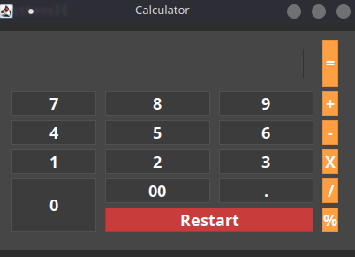

## Calculadora com operações básicas feita em java usando o kit de ferramentas *Swing* para a criação da Interface.

## Operações disponiveis: Adição, Subtração, Multiplicação, Divisão e Porcentagem

## Screenshot

